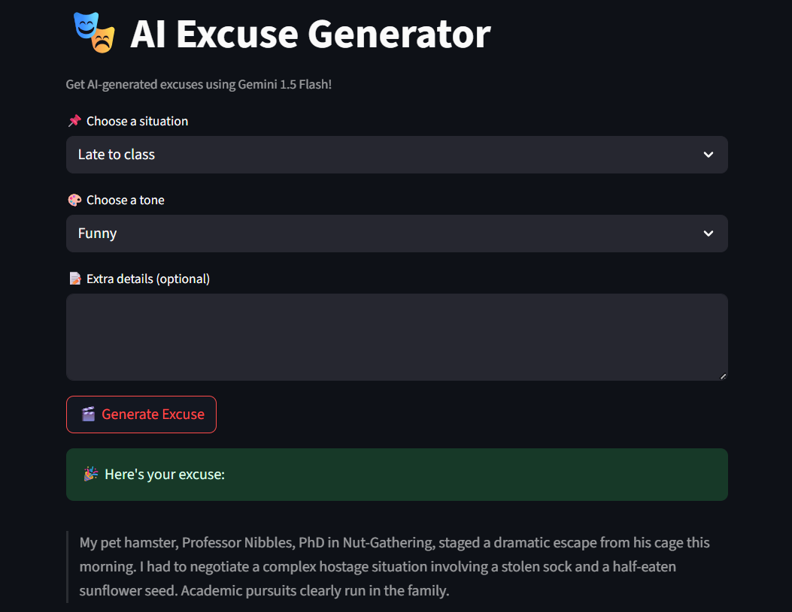
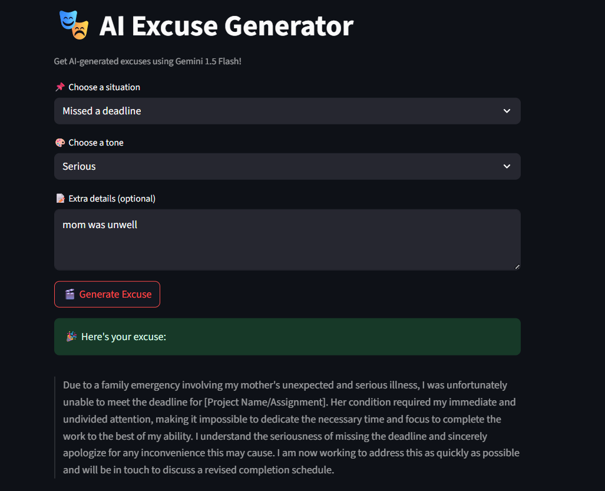
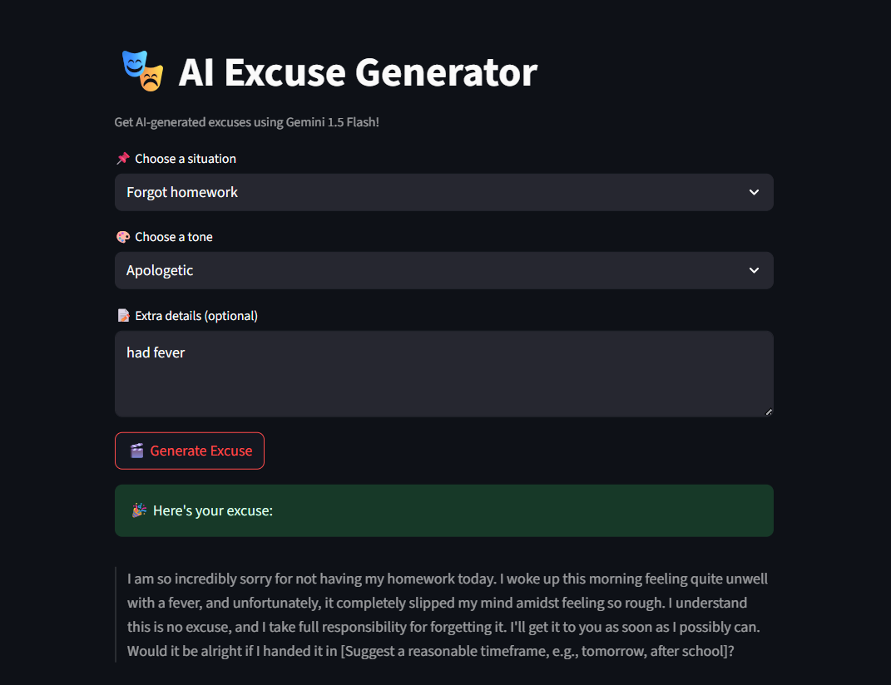

# 🎭 AI Excuse Generator

Generate hilarious, serious, or creative excuses for everyday situations using Google Gemini AI!

## 🚀 Features

- Pick a situation (e.g., "Late to class", "Missed a deadline")
- Choose the tone: Funny, Serious, Apologetic, or Creative
- Add optional extra details
- Get a polished excuse instantly from Gemini 1.5 Flash

## 📦 Requirements

Install dependencies with:

```bash
pip install -r requirements.txt
````

Or manually:

```bash
pip install streamlit google-generativeai python-dotenv
```

## 🧠 Powered By

* [Google Gemini 1.5 Flash]
* Streamlit for the frontend

## 🔐 Setting up your API Key

1. Create a `.env` file in your project directory:

```
GEMINI_API_KEY=your_api_key_here
```

2. Your `ai_excuse_generator.py` will read this key using `os.getenv("GEMINI_API_KEY")`.

3. Make sure `.env` is in your `.gitignore` (so you don’t leak your API key).

## 🏁 How to Run

```bash
streamlit run ai_excuse_generator.py
```

## 🛡️ .gitignore Example

```
.env
__pycache__/
*.pyc
*.pyo
*.pyd
*.DS_Store
```

## 📸 Screenshots










> 

## 📂 File Structure

```
├── ai_excuse_generator.py   # Main app
├── .env                     # Your Gemini API key (not tracked by git)
├── requirements.txt         # Dependencies
├── README.md                # This file
└── .gitignore               # Files to exclude from version control
```

## 👨‍💻 Author

Nitin C

---

Made with ❤️ using Gemini and Streamlit


